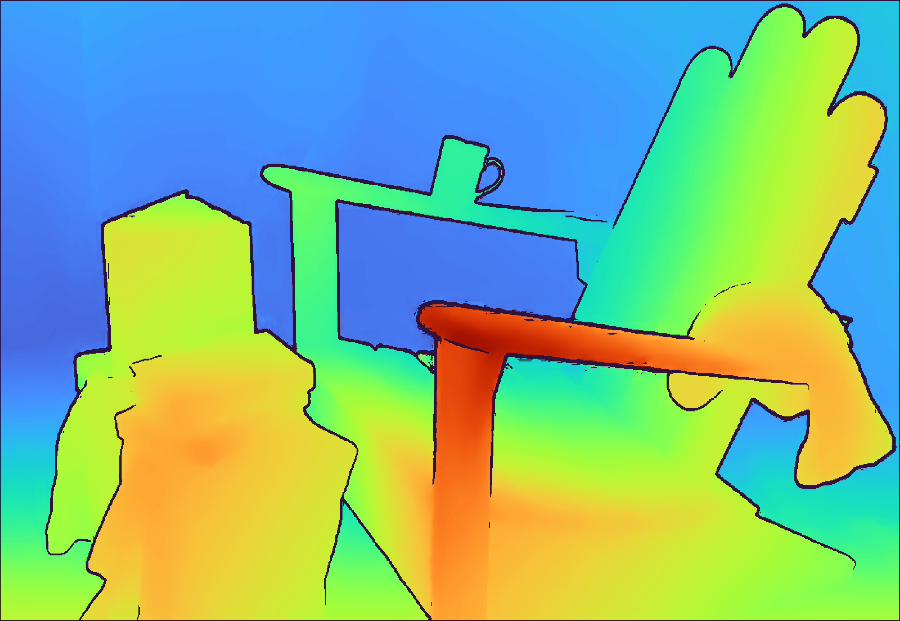

# retinify-opencv-example
This repository provides an example of how to integrate retinify with OpenCV image data processing.  
The code contents are explained in the [Tutorials](https://retinify.github.io/retinify-documentation/docs/tutorials.html) in retinify-documentation.

## 1. Install opencv
```
sudo apt install libopencv-dev
```

## 2. Install retinify
For instructions on how to install retinify, please see [Installation](https://retinify.github.io/retinify/installation.html) in retinify-documentation.

## 3. Clone this repository
```
git clone https://github.com/retinify/retinify-opencv-example.git
cd retinify-opencv-example
```

## 4. Build
```
mkdir build
cd build
cmake ..
make
```

## 4. Run
Please run the following command using the paths to your stereo images located in the `/img` directory:
```
./retinify-opencv-example <left_image_path> <right_image_path>
```

## 5. Output
